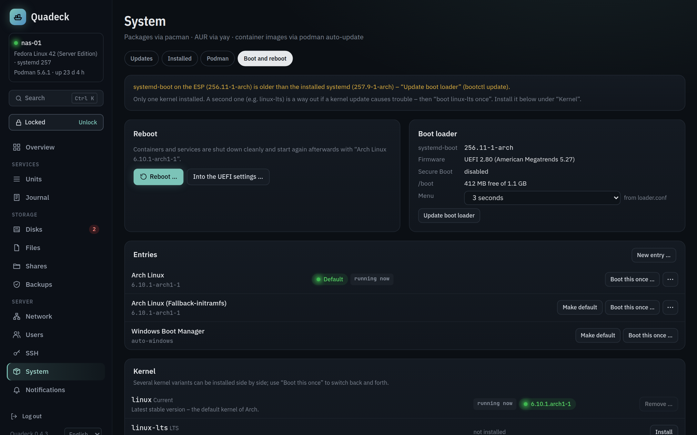
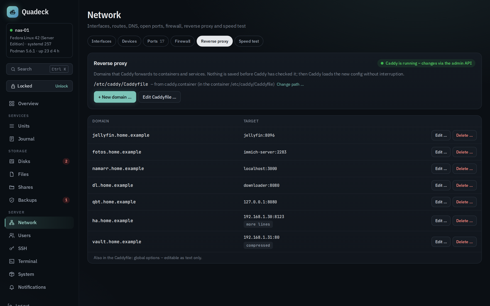
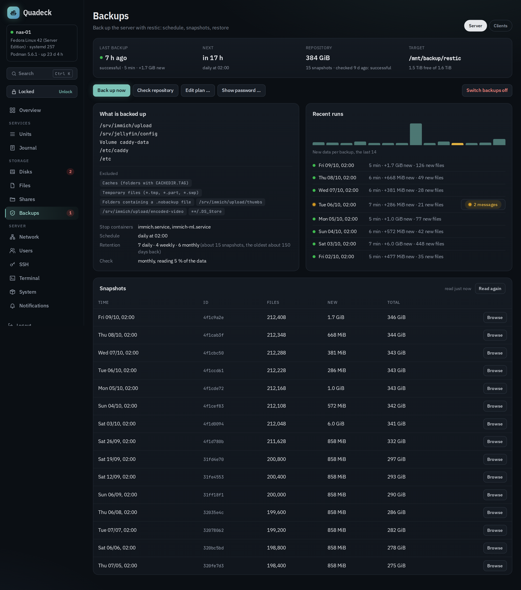
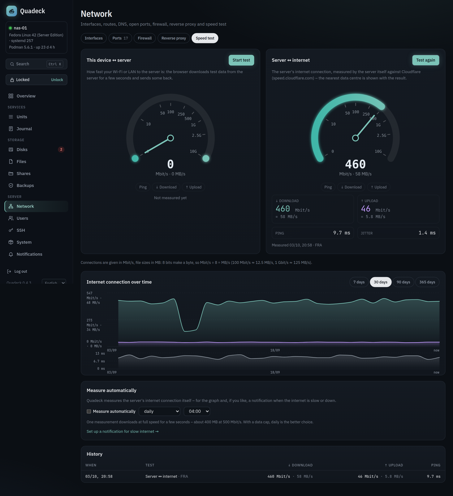
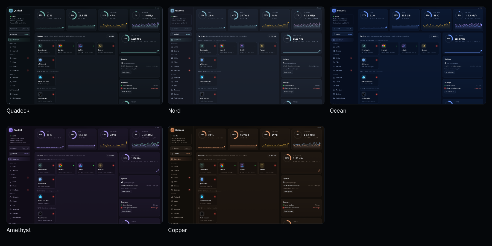

<div align="center">


**Dashboard and server console for a Podman home server.**<br>
Containers, Quadlets, systemd, updates, disks, backups, shares, users, network and reverse proxy in one place.<br>
One binary on the host. No container, no socket mounts, nothing to configure.

[](https://github.com/firsttris/quadeck/actions/workflows/ci.yml)
[](https://github.com/firsttris/quadeck/releases/latest)
[](https://github.com/firsttris/quadeck/releases/latest)
[](https://bun.sh/)
[](https://docs.podman.io/en/latest/markdown/podman-systemd.unit.5.html)

```bash
curl -fsSL https://raw.githubusercontent.com/firsttris/quadeck/main/install.sh | sudo sh
```

[Install](#-install) •
[Features](#-features) •
[Screenshots](#-screenshots) •
[Documentation](docs/README.md) •
[Development](#️-development)


</div>

## 💡 Why Quadeck?

- A web UI for **Podman Quadlets and systemd** – start, stop, edit and watch your containers and units.
- The **server around it**: disks and mounts, updates, users, Samba/NFS, backups, network.
- **Plain Linux underneath**: changes go into the usual units and config files.
- **Made for one home server**, not for clusters.

## 🚀 Install

On the server (x64 or arm64, glibc or musl):

```bash
sudo systemctl enable --now podman.socket
curl -fsSL https://raw.githubusercontent.com/firsttris/quadeck/main/install.sh | sudo sh
```

The script downloads the right binary, verifies its checksum, sets up the two systemd services and
prints a link like **http://\<host\>:8484/setup?token=…**. Open it and set your admin password.
That's it.

Update later with `sudo quadeck update`. Manual installation, environment variables, running behind
a reverse proxy and uninstalling are in the [installation guide](docs/installation.md).

### 🐧 Runs on

| | Distribution | Notes |
| --- | --- | --- |
| ✅ | Arch Linux, Manjaro, EndeavourOS | everything, including kernel management |
| ✅ | Fedora, RHEL / AlmaLinux / Rocky 9.2+ | everything except kernel management |
| ✅ | Debian 13, Ubuntu 24.04+ | everything except kernel management |
| ✅ | openSUSE Tumbleweed | everything except kernel management |
| 🟡 | Debian 12, Ubuntu 22.04, Raspberry Pi OS (64-bit) | Podman is older than 4.4: containers yes, Quadlets no |
| 🟡 | Fedora Atomic (Silverblue, CoreOS, uCore …) | packages are layered with rpm-ostree, no removal |
| 🟡 | openSUSE MicroOS, Aeon | changes go through `transactional-update`, active after a reboot |
| 🟡 | Alpine, Devuan (no systemd) | dashboard, containers, disks, files and package updates; no units, timers, Quadlets or journal |
| 🟡 | Void (no systemd) | as above, without package updates (xbps is not supported) |
| ❌ | NixOS | standard Linux binaries need `nix-ld`, `/etc` is declarative |
| ❌ | 32-bit ARM (Raspberry Pi OS 32-bit) | no Bun build for it |

Quadeck manages the **system (rootful) Podman**: `/run/podman/podman.sock` and Quadlets in
`/etc/containers/systemd`; rootless containers of other users are not shown. Boot entries need
systemd-boot. `quadeck doctor` shows what Quadeck finds on your machine, and CI starts the binary in
a container of each distribution above. What works where, feature by feature: the
[feature matrix](docs/installation.md#feature-matrix).

> [!WARNING]
> Quadeck is made for your LAN. Do not expose it to the internet without a VPN or a reverse proxy
> with its own authentication in front of it.

## ✨ Features

| | |
|---|---|
| 📊 **Overview** | Put together from widgets: CPU, RAM, temperature, network, GPU and power with history, service tiles with health checks, updates, backups, single disks, the busiest containers, one service with start/stop, LAN devices with Wake-on-LAN, speed test, SSH logins, notes and link groups; failed units with the reason and a restart button |
| 📦 **Containers & Quadlets** | Units with status and journal, CPU and RAM per container over 30 days, a Quadlet editor (form or text) checked by the real generator, templates, docker-compose import; images and volumes with what uses them, cleanup with a preview; Podman secrets instead of passwords in plain text |
| ⚙️ **systemd & timers** | Edit any unit through overrides, verified before saving; timers with a schedule builder as the cron replacement |
| ⬆️ **Updates** | pacman (with AUR), apt, dnf, zypper, apk, rpm-ostree and container images as live jobs; reboot hints and Arch news |
| 🥾 **Boot** | Reboot, boot once into another entry, edit systemd-boot entries in a form with every kernel parameter explained (copy, test once, then make it the default), second kernel on Arch |
| 🛟 **Backups** | restic to a second disk, NAS, B2/S3 or a REST server, set up in a wizard with a folder browser; what to back up suggested from the Quadlets, how long to keep chosen by how far back you want to go, snapshots to browse and restore; a rest-server as backup target for the other Linux computers, added in a wizard and set up with a one-line script, with a warning when one falls behind |
| 💽 **Disks & files** | SMART health with plain advice and a year of history, standby time per disk with spin-ups per day, usage per disk with a 30-day trend and a warning before it is full, an fstab editor that checks every change; a file explorer with two panes side by side that edits text files, unpacks and packs archives and opens photos, PDFs and videos in the browser |
| 🌐 **Network & reverse proxy** | Interfaces, devices in the LAN (name, vendor, services, Wake-on-LAN, alert on new ones), ports with the container behind them, firewall; Caddy domains in a dialog (home network only, password, compression …) |
| 🚀 **Speed test** | This device ↔ server and server ↔ internet (Cloudflare) with a live gauge in Mbit/s and MB/s; optional daily runs with a graph and an alert when the line gets slow |
| 🔐 **Users, shares & SSH** | Accounts and groups, SMB and NFS shares, SSH keys and hardening with a lock-out guard |
| 🖥️ **Terminal** | A shell on the server and inside containers in the browser – off by default, bound to the unlock, home network only |
| 🔔 **Notifications** | ntfy, Gotify, Telegram, e-mail or webhook when something fails, a disk fills up, the internet is slow or updates are waiting |

Plus: power usage and its cost (CPU and GPU measured, disks estimated from their state), hardware details (memory slots, GPU passthrough lines, stable USB paths), a command palette
(<kbd>Ctrl</kbd>+<kbd>K</kbd>), five color themes and three animation levels, English and German, a read-only mode and an unlock that expires after
15 minutes. Every page is described in the [documentation](docs/README.md).

## 📸 Screenshots

<table>
  <tr>
    <td width="50%"><br><sub><b>Quadlet editor</b> – form and text on the same file · <a href="docs/quadlets.md">docs →</a></sub></td>
    <td width="50%"><br><sub><b>Updates</b> – packages, AUR and container images · <a href="docs/updates.md">docs →</a></sub></td>
  </tr>
  <tr>
    <td><br><sub><b>Boot</b> – entries, one-time boot, kernels · <a href="docs/updates.md#boot-and-reboot">docs →</a></sub></td>
    <td><br><sub><b>Reverse proxy</b> – Caddy domains with their options · <a href="docs/network.md">docs →</a></sub></td>
  </tr>
  <tr>
    <td><br><sub><b>Disks</b> – SMART with advice · <a href="docs/disks.md">docs →</a></sub></td>
    <td><br><sub><b>Timers</b> – the cron replacement · <a href="docs/systemd.md">docs →</a></sub></td>
  </tr>
  <tr>
    <td><br><sub><b>Backups</b> – restic with snapshots to browse · <a href="docs/backups.md">docs →</a></sub></td>
    <td><br><sub><b>Speed test</b> – live gauge, both units, graph over time · <a href="docs/network.md#speed-test">docs →</a></sub></td>
  </tr>
  <tr>
    <td colspan="2"><br><sub><b>Color themes</b> – Quadeck, Nord, Ocean, Amethyst, Copper · <a href="docs/README.md#which-page-does-what">docs →</a></sub></td>
  </tr>
</table>

## 🛠️ Development

Requires [Bun](https://bun.sh/) 1.3 or newer.

```bash
git clone https://github.com/firsttris/quadeck && cd quadeck
bun install
QUADECK_DATA_DIR=.data QUADECK_FIXTURES=fixtures/demo bun run dev   # http://localhost:3000 with demo data
```

Bun, TanStack Start (React), Tailwind, SQLite with Drizzle, Vitest and Playwright; one binary per
platform through `bun build --compile`. Architecture, tests and releases:
[docs/development.md](docs/development.md).

## 🤝 Contributing

Issues and pull requests are welcome. If your distribution, package manager, GPU or firewall is
handled wrong, include the output of the command Quadeck ran (the error names it). Please run
`bun run typecheck`, `bun run test` and `bun run test:e2e` before opening a pull request.

---

<div align="center">
<sub>Quadeck is not affiliated with Podman, Red Hat, systemd or Caddy. Icons come from the
<a href="https://github.com/homarr-labs/dashboard-icons">dashboard-icons</a> collection.</sub>
</div>
