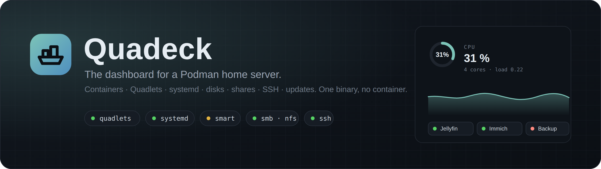
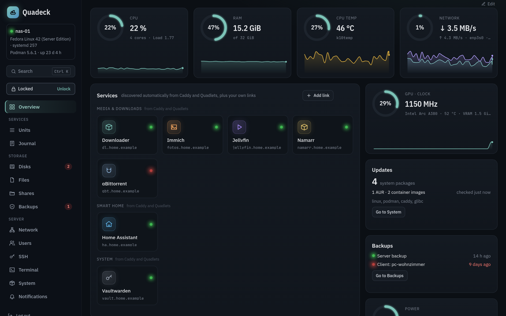
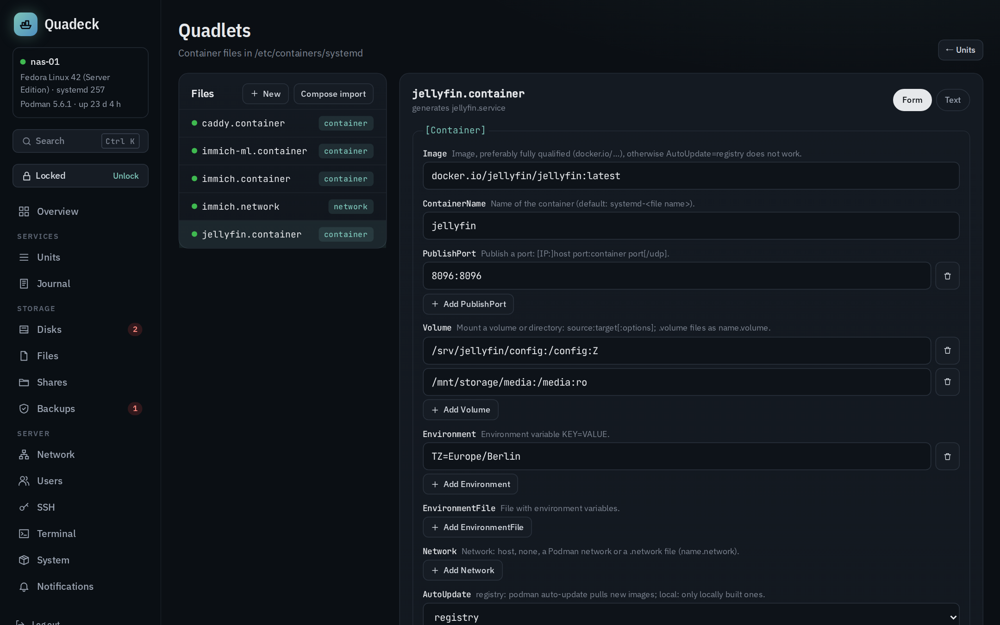
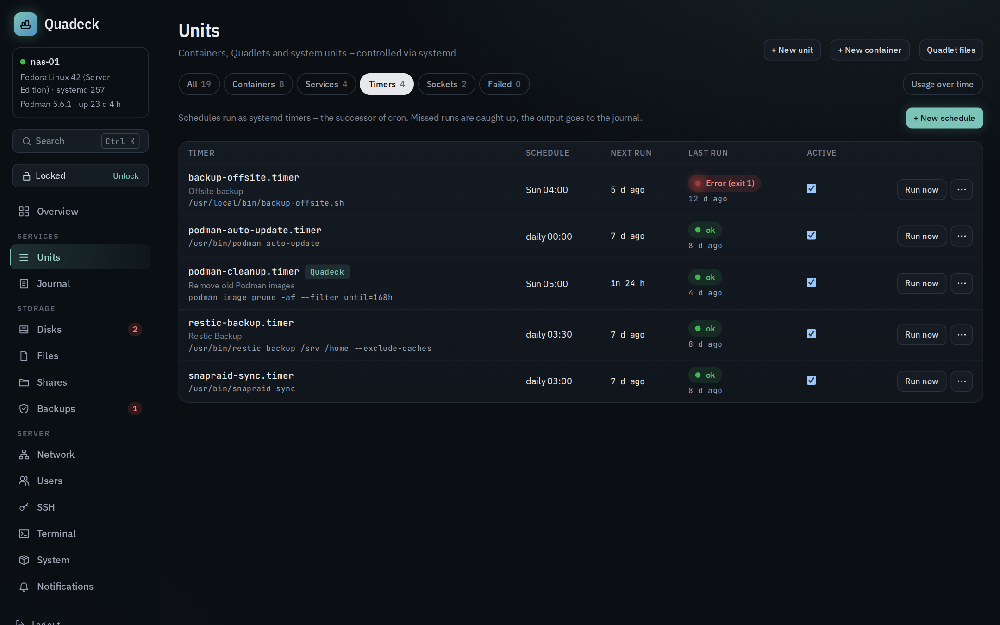
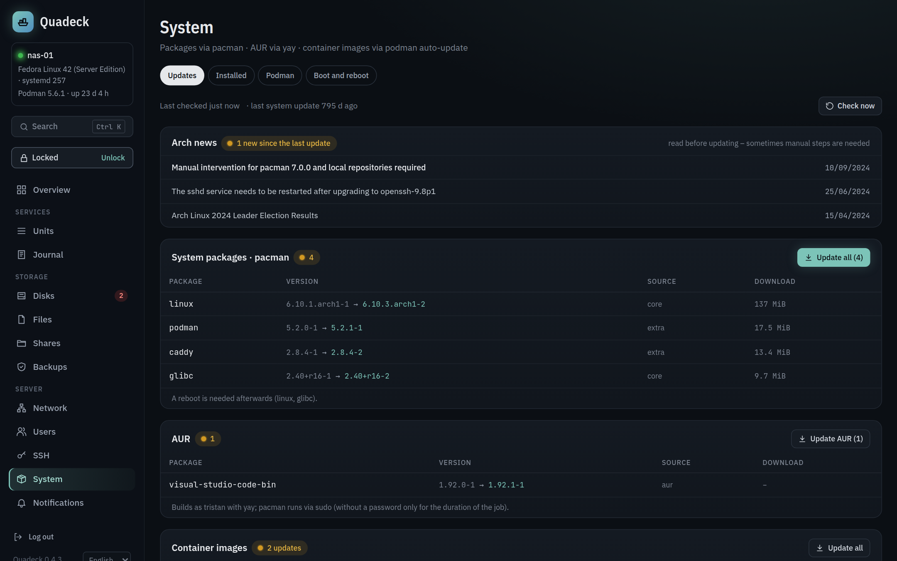
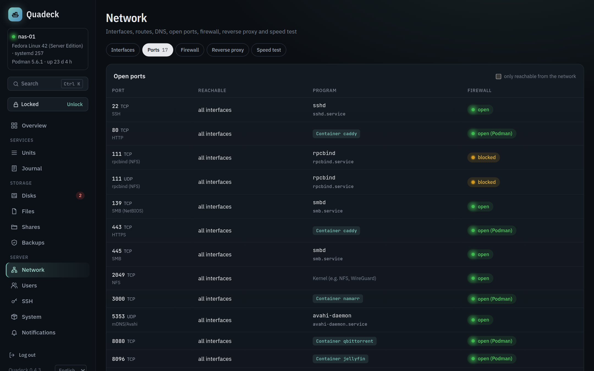

<div align="center">



**The dashboard for a Podman home server.**<br>
Containers, Quadlets, systemd, disks, shares, SSH and updates in one place.
One binary on the host, no container, no socket mounts, nothing to configure.

[](https://github.com/firsttris/quadeck/actions/workflows/ci.yml)
[](https://github.com/firsttris/quadeck/releases/latest)
[](https://github.com/firsttris/quadeck/releases/latest)
[](https://bun.sh/)
[](https://www.typescriptlang.org/)
[](https://docs.podman.io/en/latest/markdown/podman-systemd.unit.5.html)

[Features](#-features) •
[Quick start](#-quick-start) •
[Screenshots](#-screenshots) •
[Documentation](docs/README.md) •
[Development](#️-development)



</div>

## 💡 Why Quadeck?

Cockpit is a full server console, Portainer wants Docker, and most homelab dashboards are link
pages that know nothing about the machine behind them. A Podman home server with Quadlets already
has everything it needs for operations: systemd runs the containers, Caddy publishes them, the
package manager updates the host. What is missing is one place that shows all of it and lets you act
on it. That is Quadeck.

- **Zero config**: install the binary, start the service, the dashboard is filled. Services, their
  URLs and icons come from Caddy, Podman and your Quadlet files. Configuration only overrides.
- **systemd is the truth**: a container with a Quadlet unit is always started, stopped and restarted
  through systemd, never behind its back. Only containers without a unit go through the Podman API.
- **Root is a separate process**: the web app runs as its own unprivileged user. A small root helper
  with a fixed list of actions does the rest, and every change needs your admin password first.
  Even a compromised web app cannot change the server on its own.

## ✨ Features

- **Overview**: CPU, RAM, temperature, network and GPU with one hour of history under each gauge and
  up to seven days in the detail view; storage with SMART dots per disk; failed units with the
  reason (OOM kill, exit code) and a restart button; the next timers; your shares
- **Services**: tiles for every container, discovered through Caddy routes and Quadlet labels, with
  icons from [dashboard-icons](https://github.com/homarr-labs/dashboard-icons), health from the
  Podman healthcheck or an HTTP probe, groups, pinning, hiding and manual links for the router, the
  printer or other hosts. The layout is drag-and-drop editable and remembered per screen size
- **Units**: services, timers and Quadlet units with status, memory, CPU sparklines and journal;
  start, stop and restart through D-Bus; a command palette (Ctrl+K) for all of it
- **Quadlet editor**: form and text on the same file, line-exact (comments and unknown keys stay),
  checked with the real Quadlet generator before saving, diff, git history, templates and
  docker-compose import. Podman settings: auto-update timer, `containers.conf`, `registries.conf`
- **systemd editor**: every unit file with its drop-ins, vendor files read-only and changed through
  overrides (`systemctl edit` style), form with explanations, `systemd-analyze verify` before saving,
  history, new units from templates
- **Timers**: the cron replacement. Schedule builder with a live preview of the next runs, cron line
  import, templates for scripts, rsync backups, Podman cleanup and SnapRAID, run now, last result
- **Updates**: pacman (with AUR), apt, dnf, zypper, apk and rpm-ostree; reboot hints, Arch news,
  leftover `.pacnew` files; installed packages with safe removal; container image updates through
  `podman auto-update`. Jobs run as transient systemd units with live output and survive a restart
  of Quadeck itself
- **Disks**: SMART health with a verdict and advice per disk (replace it, check the cable, cool it),
  one year of temperature and error-counter history, self-tests; an `/etc/fstab` configurator that
  explains the options and checks every change (device, driver, `findmnt --verify`, systemd's
  generator, a test mount) so a disk never stops the boot; a small file explorer for the data areas
  with copy, move and delete as jobs
- **Shares**: SMB shares and NFS exports created, edited and removed in place, existing config files
  included; `testparm` and `exportfs` check every change, with rollback
- **SSH**: keys per user with last use, hardening through a drop-in with a lock-out guard, recent
  logins and failed attempts, ready-made commands for a new device
- **Network**: interfaces, routes, DNS, listening ports with the program, unit or container behind
  each one, and what firewalld or ufw does with it. Read-only by design
- **Notifications**: ntfy, Gotify, Telegram, e-mail (SMTP) or a webhook (Discord, Slack, Home Assistant) when a
  unit or timer fails, a web service is down, a container is unhealthy, SMART complains, a disk is
  nearly full or updates are available. Each problem once, with an all-clear when it is resolved
- **Install what is missing**: smartmontools, Samba, NFS or OpenSSH not installed? The page shows
  a button and the command for your distribution
- **Secure by default**: login from the first start, CSRF protection, hardened systemd units, a
  read-only mode and an unlock that expires after 15 minutes

The UI is in German.

## 🚀 Quick start

Quadeck runs directly on the host as a systemd service. It is one static binary for x64 and arm64,
glibc and musl, with no runtime to install.

```bash
sudo systemctl enable --now podman.socket
curl -fsSL https://raw.githubusercontent.com/firsttris/quadeck/main/install.sh | sudo sh
```

The script detects architecture and libc, downloads the matching binary from GitHub Releases,
verifies its SHA-256 checksum, creates the `quadeck` system user and the two services, and prints the
link for the first setup: **http://\<host\>:8484/setup?token=…**, where you set the admin password.

<details>
<summary><b>Manual installation</b></summary>

```bash
curl -fsSLo /usr/local/bin/quadeck https://github.com/firsttris/quadeck/releases/latest/download/quadeck-linux-x64-baseline
chmod +x /usr/local/bin/quadeck
groupadd --system quadeck && useradd --system -g quadeck -d /var/lib/quadeck -s /usr/sbin/nologin quadeck
quadeck print-unit helper > /etc/systemd/system/quadeck-helper.service
quadeck print-unit web > /etc/systemd/system/quadeck.service
systemctl daemon-reload && systemctl enable --now quadeck-helper quadeck
quadeck setup-token   # prints the token for http://<host>:8484/setup
```

Binaries: `quadeck-linux-x64-baseline` (every x86 server, including NAS CPUs without AVX2),
`quadeck-linux-arm64` (Raspberry Pi, ARM servers), `quadeck-linux-x64-musl` and
`quadeck-linux-arm64-musl` (Alpine and other musl distributions).

</details>

<details>
<summary><b>Updating</b></summary>

```bash
sudo quadeck update
```

Downloads the newest release for this machine, verifies the checksum, swaps the binary in and
restarts the services. Running `install.sh` again does the same and also migrates older
single-process installations to the separate root helper.

</details>

| Path | Content |
|---|---|
| `/usr/local/bin/quadeck` | the binary |
| `/var/lib/quadeck` | SQLite database, icon cache, setup token (user `quadeck`) |
| `/var/lib/quadeck-helper` | Quadlet git history, unit file history (root) |
| `/etc/quadeck/quadeck.env` | optional environment variables |

Everything else, from environment variables to running behind a reverse proxy, is in the
[installation guide](docs/installation.md).

> [!WARNING]
> Quadeck is made for your LAN. Do not expose it to the internet without a VPN or a reverse proxy
> with its own authentication in front of it.

## 📸 Screenshots

<div align="center">

<br><br>

<br><br>

<br><br>

</div>

More in the [documentation](docs/README.md).

## 📚 Documentation

| | |
|---|---|
| [Installation](docs/installation.md) | install script, binaries, commands, environment variables, services, updates, reverse proxy, uninstall |
| [Overview and services](docs/dashboard.md) | how services are discovered, labels, overrides, manual links, icons, health, layout editing, metrics history, GPU, command palette |
| [Units and Quadlets](docs/quadlets.md) | units page, actions, journal, Quadlet editor, validation, history, templates, compose import, Podman settings |
| [systemd editor and timers](docs/systemd.md) | unit files and overrides, form and text, verification, history, new units, timers, schedule builder, cron import |
| [Updates and packages](docs/updates.md) | package managers, AUR, reboot hints, jobs, installed packages, removal, container images |
| [Disks and files](docs/disks.md) | SMART verdicts and advice, history, self-tests, fstab configurator and its checks, file explorer, data areas |
| [Shares](docs/shares.md) | SMB shares, NFS exports, services, what is checked, what is never touched |
| [SSH](docs/ssh.md) | keys, hardening, lock-out guard, logins, connecting a new device |
| [Network](docs/network.md) | interfaces, ports, firewall verdicts, routes and DNS |
| [Notifications](docs/notifications.md) | channels, rules, how spam is avoided, retries |
| [Security](docs/security.md) | the two processes, unlock, authentication, hardening, data and secrets |
| [Development](docs/development.md) | setup with demo data, checks, architecture, tests, releases |

## 🛠️ Development

Requires [Bun](https://bun.sh/) 1.3 or newer.

```bash
git clone https://github.com/firsttris/quadeck
cd quadeck
bun install
QUADECK_DATA_DIR=.data QUADECK_FIXTURES=fixtures/demo bun run dev   # http://localhost:3000 with demo data
```

**Stack**: Bun, TanStack Start (React), Tailwind, SQLite with Drizzle, Server-Sent Events, Vitest and
Playwright. One binary per platform through `bun build --compile`. More in
[docs/development.md](docs/development.md).

## 🤝 Contributing

Issues and pull requests are welcome. If your distribution, package manager, GPU or firewall is
handled wrong, the output of the command Quadeck ran (it is named in the error) is the most useful
thing to include. Please run `bun run typecheck`, `bun run test` and `bun run test:e2e` before
opening a pull request.

---

<div align="center">
<sub>Quadeck is not affiliated with Podman, Red Hat, systemd or Caddy. Icons come from the
<a href="https://github.com/homarr-labs/dashboard-icons">dashboard-icons</a> collection.</sub>
</div>
