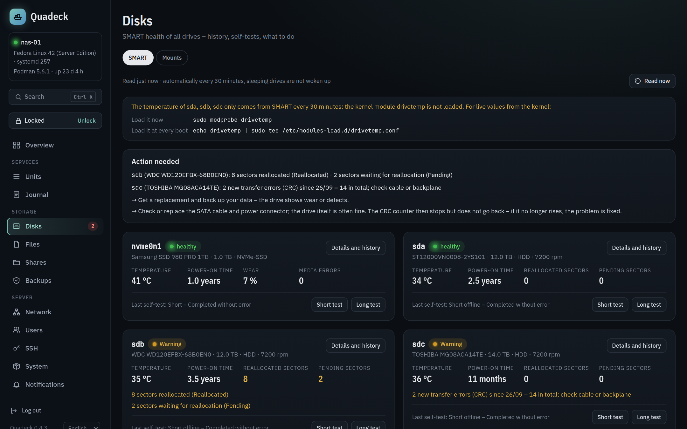

# Disks and files

The **Disks** page has two tabs: **SMART** for the health of every drive and **Mounts**,
a configurator for `/etc/fstab`. **Files** in the navigation is a small file explorer for the data
areas.



## SMART

Quadeck reads every drive with `smartctl --json` from smartmontools: every 30 minutes, on
**Check now**, and when the page opens if the last reading is older. Sleeping disks are not
woken up (`-n standby`); their last values stay until they spin up on their own.

### Per disk

Model, serial, capacity, type (HDD, SSD, NVMe), temperature, power-on hours, wear level for SSDs,
reallocated and pending sectors, uncorrectable and CRC errors, the result of the last self-test,
and a verdict.

### The verdict

The assessment is the one from [snapraid-ui](https://github.com/firsttris/snapraid-ui):

| Level | When |
|---|---|
| **critical** | the drive reports itself as failing (`FAIL`), a pre-failure attribute is below its threshold now (`PREFAIL`), wear at 100 %, temperature at 60 °C or more |
| **warning** | a pre-failure attribute was below its threshold in the past, entries in the drive's error log, reallocated, pending or uncorrectable sectors (attributes 5, 197, 198), reported uncorrectable read errors (187), CRC errors (199) that grew during the last 7 days, media errors on NVMe, wear above 80 %, temperature above 50 °C, a failed or aborted last self-test, SMART data not readable |
| **ok** | nothing of the above |

Every finding comes with what to do: *replace the disk* (status, sectors, read errors, wear,
failed test), *check the cable* (CRC errors and a filling error log are usually a cable, a port or
a power loss, not the disk), *cool it* (temperature), *check access* (SMART not readable). Virtual drives and USB bridges without SMART are
shown neutrally, not as a problem.

**CRC errors** (attribute 199, `UDMA_CRC_Error_Count`) count transfers between controller and disk
that arrived damaged and were sent again – no data is lost. The counter covers the whole life of
the disk and never goes back to zero, not after a new cable, a reboot or formatting. So Quadeck
compares it with its own history: if it grew during the last 7 days, the disk gets a warning
("5 new CRC errors since …, 14 in total"); an old count that no longer grows is only a grey note
under the disk. After swapping a cable, the counter staying where it is means the problem is
solved.

### History

Temperature, the sector and error counters and the wear level are sampled hourly and kept for a
year (daily averages beyond 30 days). A rising counter is the real warning sign, a single
reallocated sector that has been there for a year is not. The history opens per disk with 7, 30 or
365 days.

### Self-tests

**Short test** (a few minutes) and **Long test** (hours, the whole surface) start through the
helper and need the [unlock](security.md#unlock). Progress and the test log are shown on the disk.

### On the overview

The storage card shows a SMART dot per disk; the sidebar badge counts disks with a finding. Both
link here. SMART problems also go out as [notifications](notifications.md).

### Without smartmontools

The page shows an install button with the command for your distribution. Without SMART, the
storage card still shows usage and the file explorer works.

## Mounts (fstab)

**Mounts** shows which file systems `/etc/fstab` mounts where and adds, changes and removes
data disks. A broken fstab can stop the server in emergency mode at boot, so every change passes
several checks before the file is written.

### The list

- **Configured**: every entry with its mount point, file system, usage, the device behind it
  (path, label, model), whether it is mounted, and whether it would **stop the boot** when the disk
  is missing (no `nofail`). Options show their meaning on hover. Shares, NFS exports and Quadlet
  volumes below a mount point are named, so you see what depends on it.
- **System entries**: `/`, `/boot`, `/boot/efi`, `/home`, swap, pseudo file systems and subvolumes of
  the root file system are shown, never changed.
- **Not configured**: file systems on the machine that are not in the file (RAID members, LUKS
  containers and swap are left out), with **Add to fstab …**.

### Adding and changing

The dialog proposes a mount point (`/mnt/<label>`), names the device by **UUID** (stable when `sdb`
becomes `sdc`; label and PARTUUID can be chosen) and sets options for a data disk: `nofail` with a
10-second wait (`x-systemd.device-timeout=10s`), `noatime`, for btrfs `compress=zstd`, for NTFS,
exFAT and FAT owner and mask (`uid`, `gid`, `umask`, those file systems have no Linux permissions).
Switches with a sentence each cover automount on first access, read-only and `nodev,nosuid`; any
other option goes into the free field. The resulting fstab line is shown while you type, and the
fsck order is set to 2 for ext4 and 0 for file systems that are not checked at boot.

### The checks

While typing and again before writing:

1. **Form**: absolute mount point, not a system directory (`/etc`, `/usr`, `/var`, `/home`, `/boot`,
   …), known options for the file system (unknown ones are a hint, the test mount decides), values
   where an option needs one, no `ro` with `rw`, sensible fsck order.
2. **Whole file**: no mount point twice; protected lines stay exactly as they are and no new ones
   appear.
3. **Host**: the device exists (`lsblk`), carries the file system named in the entry, the driver or
   mount helper is installed (with the package to install if not), the mount point is not used by
   something else, and whether the directory is empty.
4. **`findmnt --verify`** on a copy of the new file.
5. **systemd's fstab generator** on the old and the new file (`SYSTEMD_FSTAB=<copy>`): entries that
   end up in `local-fs.target.requires` stop the boot when they fail. A change that adds such an
   entry needs an explicit confirmation that explains the consequence.
6. **Test mount**: the device is mounted once with exactly the chosen options in a private temporary
   directory and unmounted again – before `/etc/fstab` is touched. A wrong option or a damaged file
   system shows up here.

### Writing

The confirmation shows the diff and the steps. Then: create the mount point if needed, write the
file atomically (previous version as `/etc/fstab.quadeck-bak` and in the history under
`/var/lib/quadeck-helper/fstab-history`), `systemctl daemon-reload`, and start the mount unit (or
`reload` it to remount with new options; changing source or mount point unmounts first). If any
step after writing fails, the previous file is written back and reloaded. Removing an entry
unmounts it first and refuses when it is busy. **History** shows earlier versions with a diff and
restores one through the same checks.

### If the server does not boot anyway

In emergency mode, log in as root and restore the previous file:

```sh
cp /etc/fstab.quadeck-bak /etc/fstab
systemctl daemon-reload
reboot
```

## File explorer

**Files** in the navigation (`/files`) is a small explorer for the data areas, meant for moving a download into the
media folder or cleaning up, not for administering the system.

### Areas

`/mnt`, `/srv`, `/media`, `/home`, `/data` and mounted data file systems outside those, each with
its free space. `QUADECK_FILE_ROOTS` replaces the list (comma-separated). System directories
(`/etc`, `/root`, `/boot`, `/usr`, `/var`, `/proc`, `/sys`, `/dev`, `/run`, …) are never reachable,
and symlinks are resolved before the check, so a link cannot lead out of an area.

### Working with files

Open folders, path bar, show or hide hidden files, sort by name, date or size. **New folder**
(owned by the parent folder's owner), **Rename**, **Copy / Cut / Paste**,
**Delete**, also with Ctrl+C/X/V, Del and F2. Overwriting asks first; copying a folder into
itself or deleting an area is refused.

Copy, move and delete run as [jobs](updates.md#jobs) with live output (`cp -a --reflink=auto`,
`mv`, `rm -r --one-file-system`), so a large folder blocks nothing and a restart of Quadeck does not
interrupt it. Conflicts and paths outside the areas are refused before the job starts, not in a
failing job. Every change needs the [unlock](security.md#unlock). There is no trash: deleted is
deleted.

### Text files

A click on a text file opens it in the editor: scripts, patches, notes, configuration (`.sh`,
`.patch`, `.txt`, `.md`, `.yml`, `.conf`, `.env`, `Dockerfile` …). Files without a known ending
are checked by their first bytes – no NUL byte and valid UTF-8 means text; anything else (and
anything over 2 MB) is not opened. Size, owner, mode and the date are shown above the text.

Reading is free; **Next** shows the diff and **Save** needs the unlock. The file is written next to
the original and renamed over it, so it is never half written; owner, mode and Windows line endings
(CRLF) stay as they were. If the file changed since it was opened, saving is refused.

Keys and credentials are only shown after unlocking: everything in `.ssh`, `.gnupg`, `.docker`,
`.aws`, `.kube` and similar folders, `.env` files, `id_*` keys, `*.key`, `*.pem`, `.netrc`,
`.pgpass` and the like.
