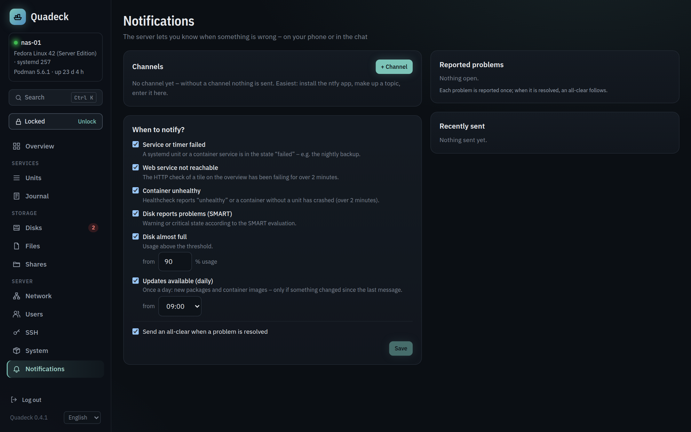

# Notifications

**Notifications** makes the server report problems instead of waiting for you to look at the
dashboard. Messages go to your phone, your chat or your inbox; each problem is reported once, and an all-clear
follows when it is resolved.

## Channels

| Channel | What you need |
|---|---|
| **ntfy** | the server (`https://ntfy.sh` or your own) and a topic; optionally an access token for protected topics. Subscribe to the topic in the ntfy app. On ntfy.sh anyone who knows the topic name can read it, so pick one that cannot be guessed |
| **Gotify** | the server URL and an application token from Gotify |
| **Telegram** | a bot token from @BotFather and your chat ID (write to the bot once, then ask @userinfobot or look at `getUpdates`) |
| **Webhook** | a URL that accepts `POST` with JSON. The body contains `title`, `message`, `severity`, and `text`/`content` with both combined, so Discord, Slack, Mattermost and Home Assistant work without a template |
| **E-mail** | the SMTP server of your mail provider: server, port, encryption, login, sender and one or more recipients. Buttons fill in server and port for Gmail, GMX, web.de, Posteo, mailbox.org, iCloud and Outlook. Most providers need an *app password* for this, not your normal password, and the sender must be your own address |

E-mail encryption: **SSL/TLS** (port 465) encrypts from the first byte, **STARTTLS** (port 587)
upgrades the connection and is required – Quadeck never falls back to plain text. **none** is only
for a relay in your own network (for example a local Postfix) and works only without a password;
a password is never sent unencrypted. The subject carries the hostname and 🔴/🟠/✅ by severity,
the body is plain text. Errors are translated: a rejected login points to the app password, a TLS
mismatch to the port/encryption pair.

Up to ten channels; each can be paused and has a **Test** button that sends a test message and
shows the result. Tokens are stored in Quadeck's database (readable only by the `quadeck` user)
and never shown again in the UI or the API.

Messages carry a priority: ntfy and Gotify get *critical* as urgent, *warning* as high, the
update summary as normal and the all-clear as low.

## Rules

Each rule can be switched off:

| Rule | Fires when |
|---|---|
| Service or timer failed | a unit (container units included) is in the `failed` state, with the reason (exit code, OOM kill) |
| Web service not reachable | the HTTP check of a service tile fails for more than 2 minutes |
| Container unhealthy | a healthcheck reports unhealthy, or a container without a unit exited with an error, for more than 2 minutes |
| Disk reports problems (SMART) | the [SMART verdict](disks.md#the-verdict) is warning or critical |
| Disk almost full | usage is above the threshold (50–99 %, default 90 %) |
| Internet slow or down | only with the automatic [speed test](network.md#speed-test): two runs in a row below the limit (relative to the usual speed or a fixed Mbit/s value) or Cloudflare not reachable; off by default |
| Updates available (daily) | once a day from the chosen hour: package updates and new container images, only when the list differs from the last message |

## How spam is avoided

- A problem is reported **once**. It stays "reported" until it is gone; then, if enabled, one
  all-clear is sent ("backup.service is running again").
- Several new problems at the same time become **one message** with a list; the highest severity
  sets the priority.
- Web service and container checks must fail for **2 minutes** before they count, so a restart
  does not page you.
- A nearly full disk is reported at the threshold and counts as resolved only **3 % below** it,
  so a disk hovering around 90 % does not ping-pong.
- What was reported is stored in the database and **survives a restart** of Quadeck.
- When a source is not readable at the moment (systemd unreachable, SMART not installed), its
  problems are neither reported nor cleared; no false all-clear.
- When a message reaches **no channel** at all, the problems are reported again after 5 minutes;
  partial failures (one channel of two) are logged, not retried.

The page lists the problems currently reported and the last 50 messages with the result per
channel, so you can see what was sent and why a channel failed.

## Where this runs

Notifications are evaluated in the web app on every new snapshot (every few seconds) and need no
root; the update summary asks the helper for the cached update lists every 15 minutes and sends
once per day.
