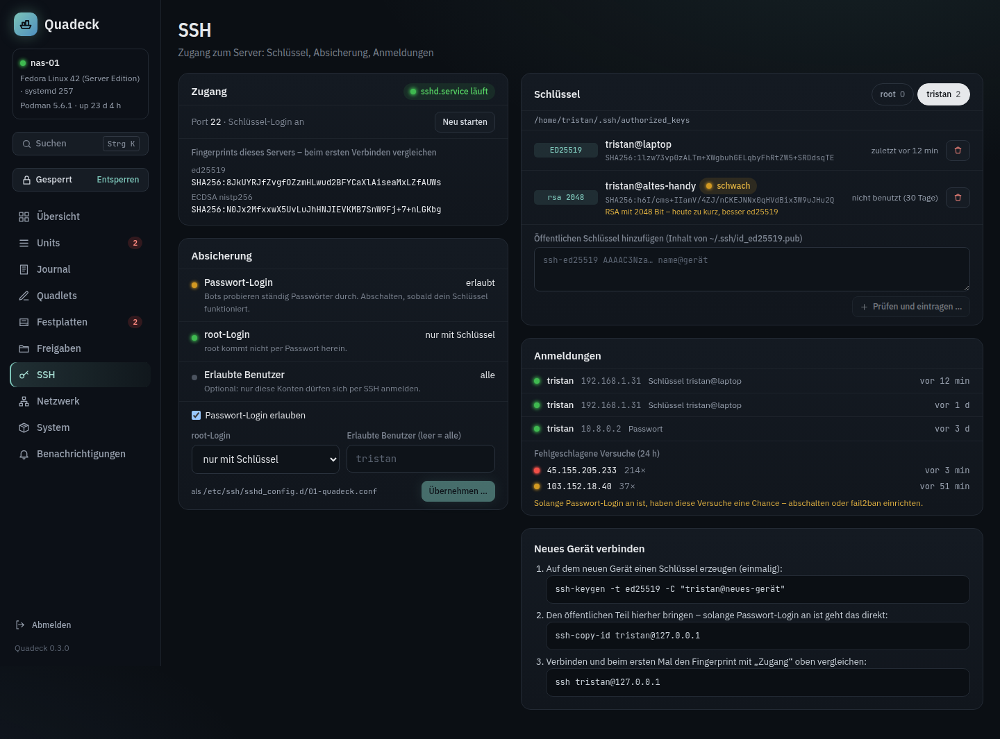

# SSH

The **SSH** page helps with access to the server: who can get in, with which keys, how the server is
hardened, and who tried.

## Access

State of `sshd` (or `ssh` on Debian), the port it listens on, start, restart and enable at boot.
There is deliberately no stop button: stopping SSH on a headless server locks you out.

The **host key fingerprints** (SHA256, as `ssh-keygen -l` prints them) are shown so you can compare
them when a client asks "are you sure you want to continue connecting?" the first time.

## Keys per user

For every user with a home directory, `~/.ssh/authorized_keys`: key type, size, comment, SHA256
fingerprint, and when the key was last used (from the journal's "Accepted publickey" lines).

- **Add a key**: paste the public key line. It is parsed and checked: duplicates and DSA keys are
  refused, RSA keys below 3072 bits are marked as weak. Keys with options in front of them
  (`from=`, `command=`, …) are not added through the UI; existing ones are shown with their
  options. `~/.ssh` and `authorized_keys` are created with `700`/`600` and the right owner when
  needed.
- **Remove a key** by fingerprint.
- Permission problems that make `sshd` ignore the file (world-writable home, wrong owner) are
  shown, because they are the usual reason a key "does not work".

## Hardening

Password login, root login (`yes`, `prohibit-password`, `no`) and the allowed users are written as
a drop-in `/etc/ssh/sshd_config.d/01-quadeck.conf`; your `sshd_config` is never edited. Before
writing, `sshd -t` checks the result; if it refuses, the drop-in is rolled back. After writing,
`sshd` is reloaded. The page shows the values that are actually in effect from `sshd -T`, not what
the file says.

### Lock-out guard

Switching password login off or removing the last working key is allowed only when somebody can
still log in with a key afterwards: a user who is still allowed, is not root when root login is
off, has no permission problems, and has at least one key without restricting options. Otherwise
the change is refused with the reason, and only an explicit confirmation forces it.

## Logins

The last successful logins (user, IP, key or password, time) and the failed attempts of the last
24 hours grouped by IP, both from the journal. A login counts as **connected** (green dot) only
while its connection is still open: the client address and port from the journal are matched
against the established connections to sshd's ports (`ss -Htn state established`). Older logins
are shown with a grey dot.

## New device

Ready-made commands with the server's address filled in: `ssh-keygen` for a new key on the client,
`ssh-copy-id` to install it, and `ssh` to connect. Copy, paste, done.

## Without OpenSSH

The page shows an install button with the command for your distribution and enables the service
after installing.
