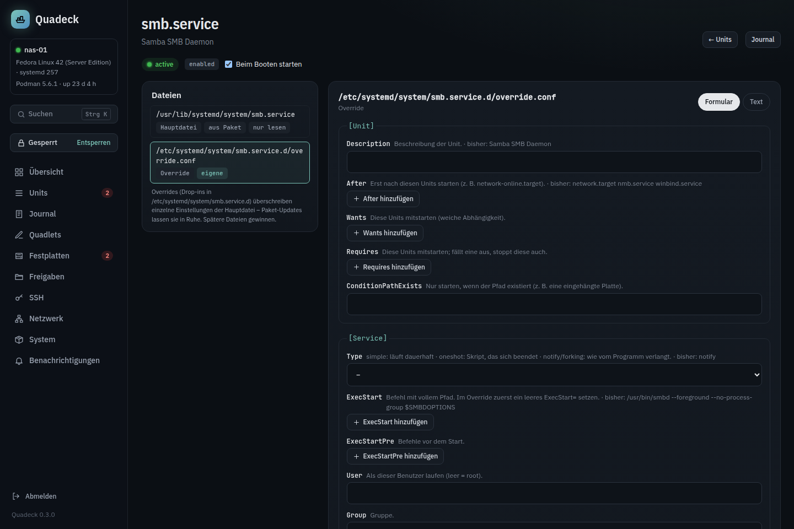

# systemd editor and timers

Quadeck edits systemd the way `systemctl edit` and `systemctl cat` do, with a form, a check before
saving and a history, and treats timers as what they are: the cron replacement.

## Unit editor

**Edit** on a non-Quadlet unit in the units list opens `/systemd?unit=<name>`. The page
shows every file that makes up the unit, as `systemctl cat` would:

- the **main file** (fragment), with its origin: *from package* (vendor, `/usr/lib/systemd/system`),
  *own* (`/etc/systemd/system`), *generated* (a generator, for example Quadlet), *transient*
  (`systemd-run`);
- the **overrides** (drop-ins in `<unit>.d/`) in the order systemd applies them, later ones win.

### Vendor files stay vendor files

A file from a package is shown read-only. Settings are changed through an **override**:
**+ Add override** creates `/etc/systemd/system/<unit>.d/override.conf` with only the keys you
set. Package updates leave it alone, **Remove override** restores the package default. Own units
in `/etc/systemd/system` are edited directly; only those can be deleted.

Quadlet-generated units get the same treatment: the generated file is read-only, overrides are
possible, and the page points to the Quadlet file for changes to the container itself.

Instances of templates (`foo@bar.service`) show the shared template file; an override there applies
to the instance only.

### Form and text

The form covers the keys that are usually worth changing, each with an explanation: description,
dependencies, conditions; command, user, group, working directory, environment, restart policy,
timeouts, memory and CPU limits, nice level, hardening (`NoNewPrivileges`, `ProtectSystem`,
`ProtectHome`, `PrivateTmp`, `ReadWritePaths`); for timers the schedule keys; `WantedBy`. In an
override every field shows what currently applies from the earlier files ("currently: …"). Keys the
form does not know are listed and stay as they are; **Text** edits the whole file.

### Verification

Before saving, the file is checked twice: a syntax check in the browser (a key before the first
section, a line that is neither section nor `Key=Value`, a main file without any section), then
`systemd-analyze verify` on a copy in a temporary directory together with the main file. Errors
come back with line numbers and block saving; hints such as unknown keys, a missing program or a
missing dependency are shown but do not block.

One hint deserves a word: `ExecStart=`, `OnCalendar=` and `ListenStream=` are lists in systemd. An
override that sets `ExecStart=/new/command` *adds* a second command, which systemd refuses for a
simple service. The editor explains that an empty `ExecStart=` line must come first to reset the
list, and the templates do it that way.

### Saving, history, enable

**Save …** shows the diff, offers a restart when the unit is active, writes atomically through
the helper and runs `daemon-reload`. Every version (the original before the first change, every
save, the content before a deletion) is kept under `/var/lib/quadeck-helper/unit-history`, up to
30 per file, and can be loaded back into the editor from **History**. **Start at boot**
switches `systemctl enable`/`disable`.

Quadeck's own units (`quadeck.service`, `quadeck-helper.service`, `quadeck-job-*`) are read-only:
editing them could cut the branch Quadeck sits on.

### New units

**+ New unit** on the units page creates a unit in `/etc/systemd/system` from a template: a
permanent service with restart on failure, a one-shot script at boot, a hardened service
(`User=nobody`, `ProtectSystem=strict`, `ProtectHome`, `PrivateTmp`, `ReadWritePaths`), or an
empty skeleton. The template follows the name you type until you edit the text. **Create** verifies
the file, writes it, reloads systemd and, if chosen, enables and starts it right away (`start`
only when the unit has no `[Install]` section).

## Timers

Timers replace cron on a systemd host: a `.timer` starts a `.service` on a schedule, the output
goes to the journal, `Persistent=true` catches up on runs that were missed while the server was
off, and you can see when a timer last ran and when it runs next. **Units → Timer** is Quadeck's
schedule editor.

### The list

Every timer with its schedule in plain words ("daily 03:30", "Mon–Fri 07:00", "every 15 minutes"),
the next run, the last run with its result (ok, running, failed with exit code, never), whether it
is enabled, the service it triggers and the command behind that service (`ExecStart` of the
service). Timers Quadeck created carry a *Quadeck* chip.

Per timer: **Run now** starts the service once right now, the switch enables or disables
the timer, **Journal** opens the service's journal, a click on the name shows the unit files
(`systemctl cat` of timer and service) with links into the unit editor.

### New schedule

**+ New schedule** creates a timer and its service in one go:

- **Name** (becomes `<name>.service` and `<name>.timer`), description.
- **Command**: run with `/bin/sh -c`, several lines allowed, quoting is handled (`$`, `%`, quotes
  and backslashes are escaped for the unit file).
- **Schedule** with the builder: every N minutes, hourly at a minute, daily at a time, weekdays
  at a time, monthly on a day, or a custom `OnCalendar=` expression. While you type, the next five
  runs are computed by `systemd-analyze calendar` and shown; an invalid expression is reported.
- **Import from cron**: a crontab line such as `30 3 * * 1-5 /usr/local/bin/backup.sh` is
  translated to `OnCalendar=` (ranges, steps, names, `@daily` and friends included); the command
  is taken over. When both a day of month and a weekday are set, a hint explains that cron means
  *or* and systemd means *and*. `@reboot` is refused with a pointer to a plain unit.
- **User**, **working directory**, and the options *catch up on missed runs* (`Persistent=true`),
  *wait for network* (`network-online.target`), *low priority* (`Nice=10`, idle I/O) and *random
  delay* (`RandomizedDelaySec`).
- **Templates**: run a script, rsync backup, Podman image cleanup, SnapRAID sync and scrub,
  healthcheck ping.
- The **Unit files** tab shows the two files that will be written.

Saving verifies both files with `systemd-analyze verify` (on failure the previous files are
restored), reloads systemd and enables the timer (`enable --now`) unless *Timer active* is off.
The settings are stored as a comment in the service file, so the form can show them again.
If the files are later edited by hand, Quadeck notices and offers only the schedule override for
that timer from then on.

### Other timers

Timers from packages or written by hand keep their files. **Schedule** changes only the schedule,
as a drop-in `<timer>.d/50-quadeck.conf` that resets `OnCalendar=` and sets the new one; monotonic
triggers (`OnBootSec=` and friends) stay. **Restore default** removes the drop-in. Only
timers Quadeck created can be deleted here.

### Schedule expressions

Some `OnCalendar=` values the builder produces, for reference:

| Builder | `OnCalendar=` |
|---|---|
| every 15 minutes | `*-*-* *:00/15:00` |
| hourly at :05 | `*-*-* *:05:00` |
| every 6 hours | `*-*-* 00/6:00:00` |
| daily 03:30 | `*-*-* 03:30:00` |
| Mon–Fri 07:00 | `Mon..Fri *-*-* 07:00:00` |
| 1st of the month 04:00 | `*-*-01 04:00:00` |

`systemd-analyze calendar '<expression>'` on the host shows the same preview.
